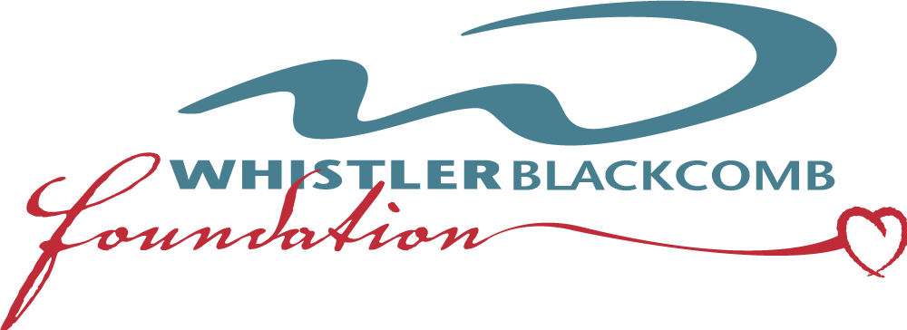

We look forward to seeing you on March 6th, 2026! Check back here for a list of products being poured at the event.

Tickets on sale early December. Visit [whistlerblackcombfoundation.com](https://whistlerblackcombfoundation.com)

Interested in being a vendor? Contact [jkerrigan@whistlerblackcombfoundation.com](mailto:jkerrigan@whistlerblackcombfoundation.com)

<!--
# WELCOME TO THE 2025 WHISTLER WINETASTIC

 Presented by RE/MAX Sea to Sky Real Estate

 This site provides you with a list of all the beverage products you will see in the room tonight. Take note of your favorites as well as the code/SKU marked next to it so that you can easily find it from your local liquor store in BC. Many of the products here are also for sale in the Foyer this evening, so you can buy after you try with a portion of the proceeds going to the Whistler Blackcomb Foundation!
 
Thank you for your support and we hope you enjoy your evening. Cheers!

## Our Mission

The Whistler Blackcomb Foundation has raised over 22 million for Registered Sea to Sky Charities making it the largest fundraising organization in the area. Our mandate is to support larger, more everlasting community projects within the Sea to Sky Corridor, as well as to build a stronger relationship with residents of the community. The Whistler Blackcomb Foundation is dedicated to providing financial support to organizations whose activities provide benefit to residents of the Sea to Sky Corridor in the areas of health, human services, education, recreation, arts & culture and the environment with a special emphasis placed on youth and family programs.

> The Whistler Blackcomb Foundation  
4545 Blackcomb Way  
Whistler, BC  
V8E 0X9  
[whistlerblackcombfoundation.com](https://whistlerblackcombfoundation.com)

# THANK YOU

The Whistler Blackcomb Foundation would like to sincerely thank the Corporate Sponsors of the 24th Annual Whistler Winetastic.  

  
    
      
    
  

And a huge thank you to all of the attendees of this evening’s event. The Sea to Sky Community is lucky to have you in it!
-->
